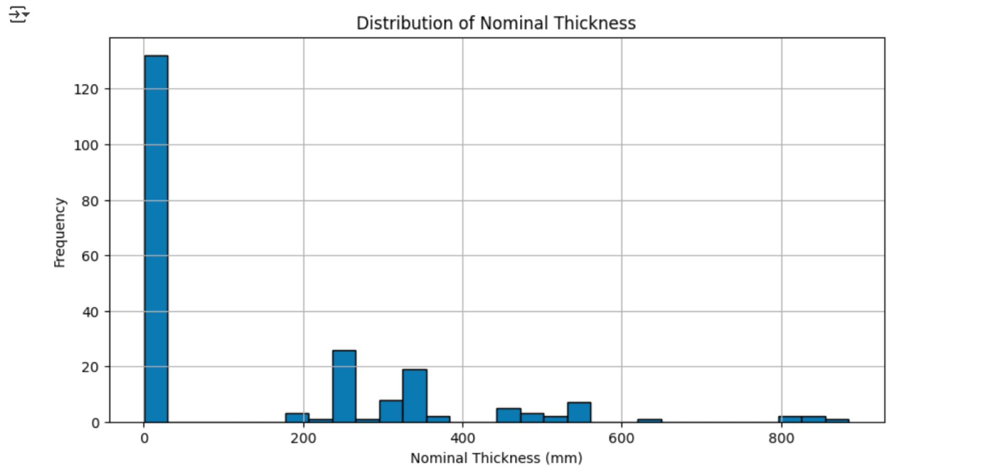
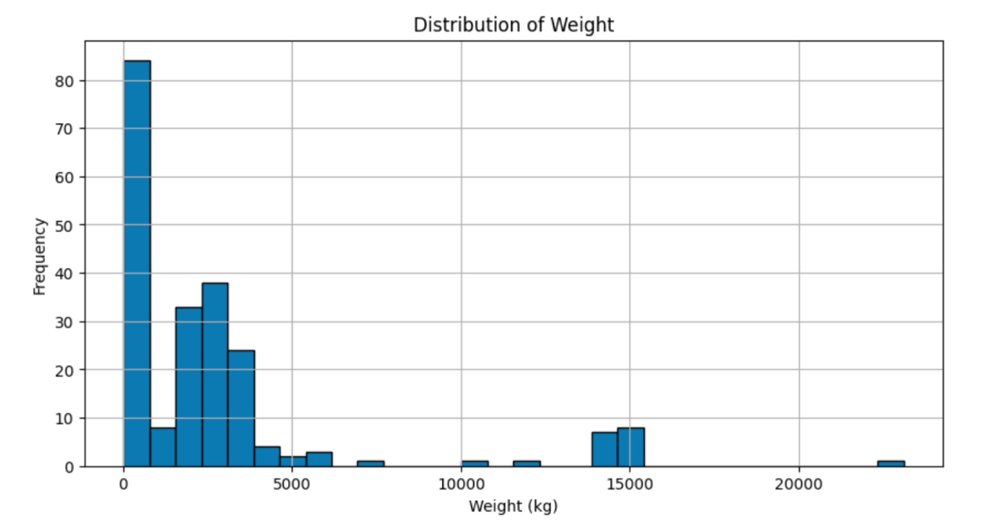
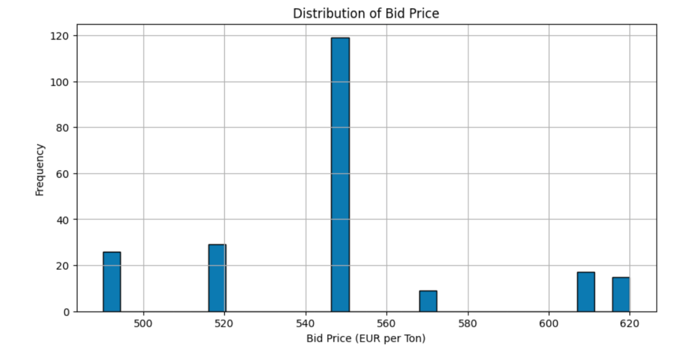
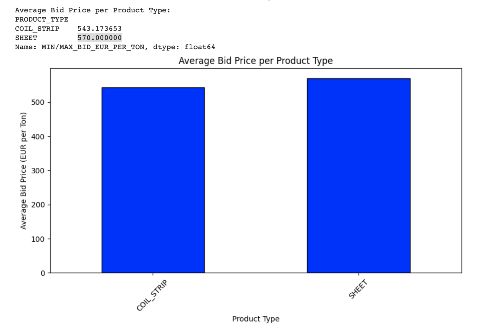

# Task 1 - Inventory Dataset: Data Cleaning, Translation, and Analysis

## Overview
This project involves cleaning, merging, and analyzing two supplier datasets containing metal inventory data. One dataset is in English, while the other is in German, requiring translation and data standardization. Additionally, AI models were utilized to streamline data processing and enhance efficiency. The Code is present in google colab and also added in the repository.

## Datasets Description
### **Dataset 1: Metal Quality and Composition (supplier_data_1.xlsx)**
This dataset contains material properties, chemical compositions, and mechanical properties of metals. Key columns include:
- **Material Properties**: "Werksgüte" (Plant Quality), "Bestellgütentext" (Order Quality), "Nenndicke" (Nominal Thickness), "Breite" (Width), "Länge" (Length), "Gewicht" (Weight).
- **Chemical Composition**: Si, Mn, P, Mo, V, Cu, Nb, Ti, Al, B contents.
- **Mechanical Properties**: "Streckgrenze" (Yield Strength), "Zugfestigkeit" (Tensile Strength), "Dehnung" (Elongation).
- Some missing values exist in composition and mechanical properties.

### **Dataset 2: Order and Procurement Data (supplier_data_2.xlsx)**
This dataset contains order details, material specifications, defect information, and pricing. Key columns include:
- **Order Details**: ORDER_ID, PRODUCT_TYPE, SITE, MATERIAL_NAME, MATERIAL_NUMBER.
- **Material Specifications**: MATERIAL_QUALITY_NORM, SURFACE_COATING.
- **Defect Information**: DEFECT_NOTES.
- **Dimensions & Weight**: NOMINAL_THICKNESS_MM, WIDTH_MM, HEIGHT_MM, MASS_MIN_KG.
- **Delivery & Pricing**: DELIVERY_EARLIEST, BUY_NOW_EUR_PER_TON, CO2_PER_TON_MAX_KG, VALID_UNTIL.
- Some missing values exist in SURFACE_COATING, NUMBER_OF_COILS, DELIVERY_EARLIEST.

## Data Cleaning & Merging Process
- Translated German column names and key values into English.
- Identified equivalent columns to merge:
  - **"Nominal Thickness (mm)"** ↔ **"NOMINAL_THICKNESS_MM"**
  - **"Width"** ↔ **"WIDTH_MM"**
  - **"Length"** ↔ **"LENGTH_MM"**
  - **"Weight (kg)"** ↔ **"MASS_MIN_KG"**
- Handled missing values using appropriate imputation techniques.
- Standardized data formats to enable smooth integration.
- The cleaned and merged dataset is saved as **inventory_dataset.xlsx**.

## Business Insights
### **1. Thickness & Weight Distribution**
- Most metal products have thicknesses clustered around lower values, with some outliers.
- Weight distribution varies significantly, indicating a diverse inventory.

### **2. Bid Price Distribution**
- Bid prices vary significantly, with most prices concentrated around **500-550 EUR per ton**.
- Some bids exceed **600 EUR per ton**, indicating premium or high-demand materials.

### **3. Product Type vs. Pricing**
- **COIL_STRIP** has an average bid price of **543.17 EUR per ton**.
- **SHEET** has an average bid price of **570.00 EUR per ton**.

## Technologies Used
- **Python** (pandas, numpy, openpyxl, deep-translator)
- **Jupyter Notebook** for data analysis
- **AI Models** for data processing and cleaning

## Notebook File
https://colab.research.google.com/drive/12r56CuDfh_qZkmuZQY1pHaJjFcbFAtdV?usp=sharing

