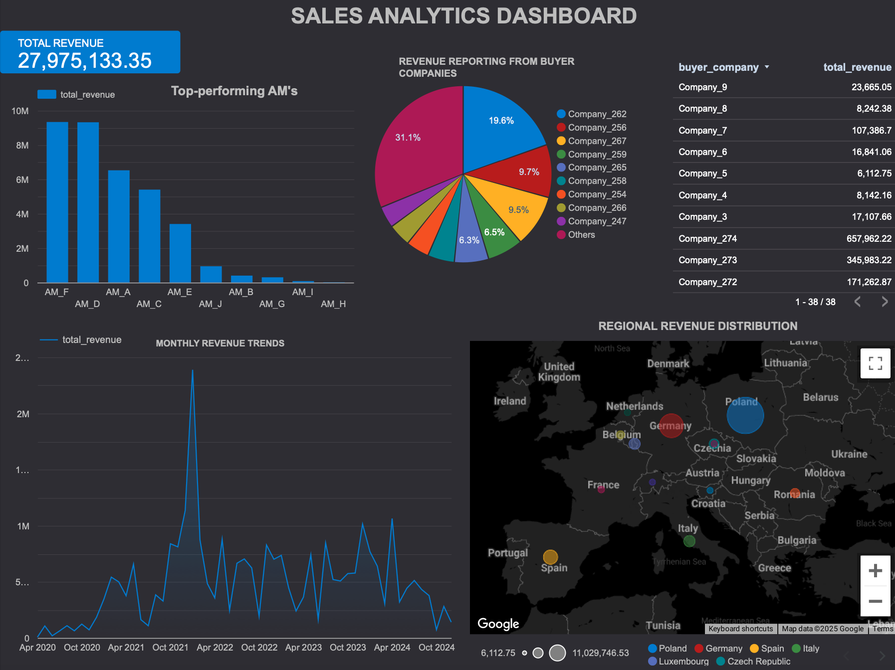

# **Sales Insights & Analysis**

## **Overview**

The analyzes of sales data using **Looker Studio** and **BigQuery SQL operations** to provide key insights into **Account Manager performance**, **Buyer Revenue**, and **Regional Sales Trends**.

---
The Deals data is uploaded on Googe Big Query.

Links for the Dashboard : https://lookerstudio.google.com/reporting/126a5bcb-1925-4cdc-b1ba-523395bd2b37



## **Key Findings**

### **1. Account Manager Performance**

- **Top AMs**: `AM_F (€9.35M)`, `AM_D (€9.33M)`, `AM_A (€6.52M)`
- **Low Performers**: Require targeted training & mentorship.
- **Revenue Share**: 100% if AM is on both buyer & supplier sides, 50% if on one side.

### **2. Buyer Revenue Insights**

- **Top Buyers**:
  - `Company_262 (€5.47M)`, `Company_256 (€2.71M)`, `Company_267 (€2.67M)`
  - These companies contribute **50%+** of total revenue.
- **Smaller Buyers**: Need upselling & engagement strategies.

### **3. Regional Revenue Trends**

- **Top Region**: `Germany (€11.03M)`, followed by **Poland, Spain, Italy**.
- **Expansion Focus**: Luxembourg & Czech Republic for growth opportunities.

### **4. Seasonal Trends**

- Revenue peaks in **April & October**, requiring optimized inventory & logistics.

---

## **Implementation in Looker Studio & BigQuery**

### **Looker Studio Dashboard**

- **Data Source**: Connected BigQuery table `vanillasteel-452308.sale_deals.deals`
- **Visualizations**:
  - **Account Manager Performance Table & Bar Chart**
  - **Buyer Revenue Table & Pie Chart**
  - **Regional Sales Map & Monthly Trends Line Chart**

### **SQL Queries Used**

1. **Account Manager Performance Analysis**

```sql
WITH revenue_split AS (
    SELECT buyer_am AS account_manager, booked_gross_revenue * 
    CASE WHEN buyer_am = supplier_am THEN 1.0 ELSE 0.5 END AS revenue_share
    FROM `vanillasteel-452308.sale_deals.deals`
    UNION ALL
    SELECT supplier_am AS account_manager, booked_gross_revenue * 
    CASE WHEN buyer_am = supplier_am THEN 1.0 ELSE 0.5 END AS revenue_share
    FROM `vanillasteel-452308.sale_deals.deals`
)
SELECT account_manager, SUM(revenue_share) AS total_revenue 
FROM revenue_split GROUP BY account_manager ORDER BY total_revenue DESC;
```

2. **Revenue by Buyer Company**

```sql
SELECT buyer_company, SUM(booked_gross_revenue) AS total_revenue 
FROM `vanillasteel-452308.sale_deals.deals` 
GROUP BY buyer_company ORDER BY total_revenue DESC;
```

---

